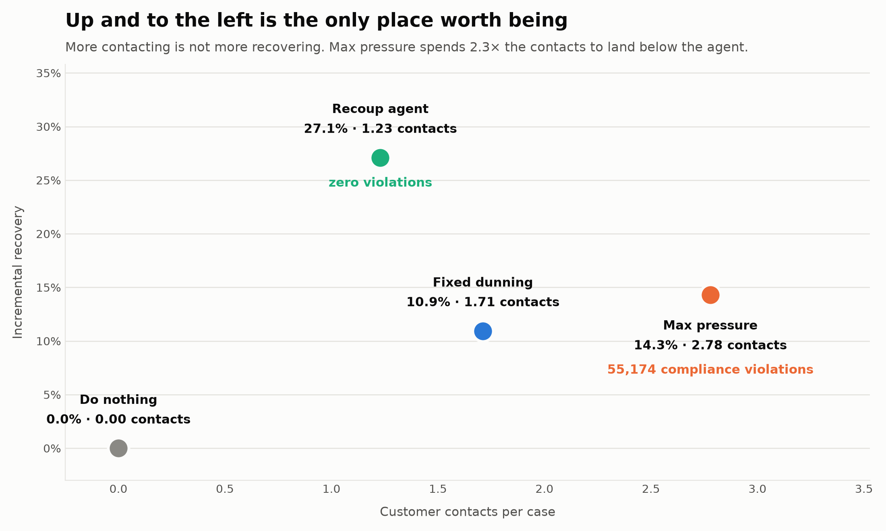
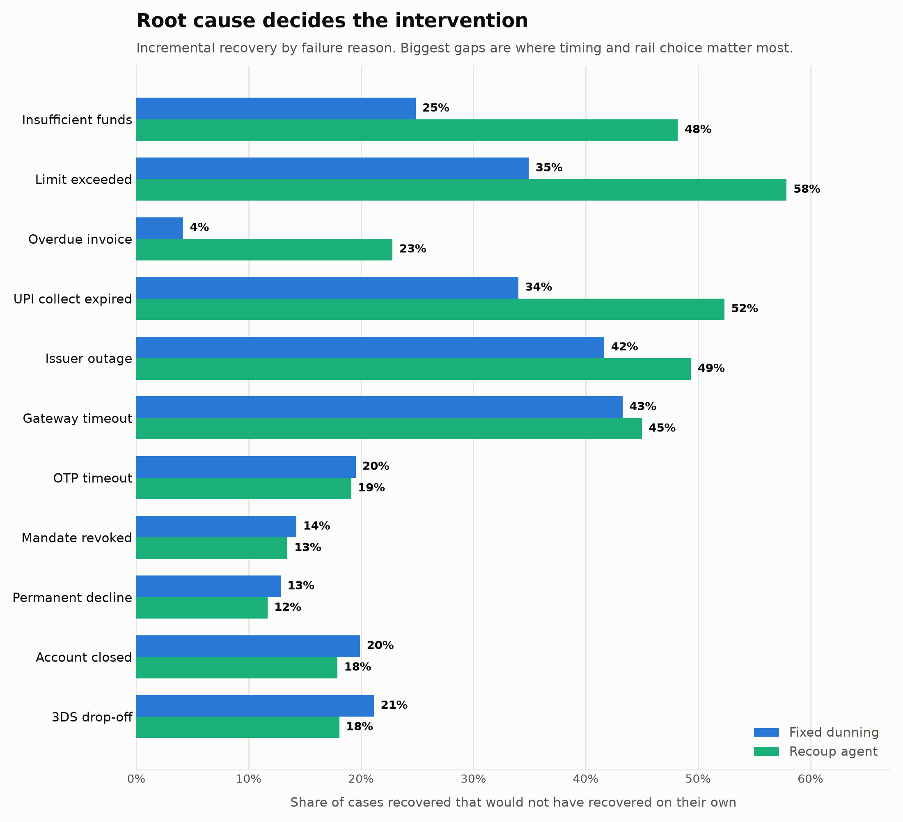
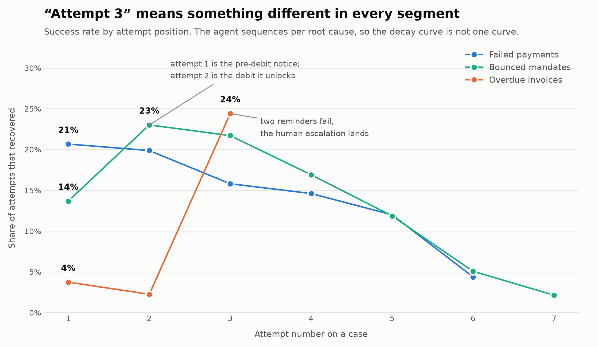

# Recoup

**A bounded revenue recovery agent.** Detects money slipping away, diagnoses
why, chooses the right intervention, executes it under a hard compliance
guardrail, and stops when it stops paying.

Razorpay Buildathon 2026 — Track 3, AI Revenue Recovery.

---

## Result

Across **10,000 at-risk cases worth ₹3.99 Cr**, measured against three baselines
on the same cases with the same pre-drawn luck:

| | do nothing | fixed dunning | max pressure | **Recoup** |
|---|---|---|---|---|
| Incremental recovery | ₹0 | ₹43.6 L | ₹57.1 L | **₹1.08 Cr** |
| Contacts per case | 0.00 | 1.71 | 2.78 | **1.23** |
| Cost per ₹ recovered | — | ₹0.0010 | ₹0.0026 | ₹0.0033 |
| **Compliance violations** | 0 | 0 | **55,174** | **0** |

**₹1.08 Cr incremental — +148% over a standard dunning ladder, with 28% fewer
customer contacts and zero compliance violations.**

The number that matters most is on the core segment:

| Failed payments (6,229 cases, ₹84.5 L) | fixed dunning | max pressure | **Recoup** |
|---|---|---|---|
| Incremental rate | 33.2% | 36.8% | **41.0%** |
| Contacts per case | 1.68 | 2.62 | **0.97** |
| Cost per ₹ recovered | ₹0.0010 | ₹0.0028 | **₹0.0006** |

Recoup beats the *unguarded* maximum-pressure arm on every segment while
contacting 42% fewer people. **Targeting beats volume, and the guardrail costs
nothing.**

> Recovery here is **incremental**: a case that also recovers under "do
> nothing" is not counted. Roughly 20% of at-risk value comes back on its own,
> and counting it is the easiest way for a recovery product to flatter itself.







Regenerate with `python -m recoup.eval.charts --cases 10000`.

---

## The four things this had to prove

The track brief asks for measured money across a batch, compliant escalation,
stopping rules, and an audit trail. Each maps to a directory:

| Requirement | Where |
|---|---|
| Measured money across a batch | `recoup/eval/` — 4 arms, common random numbers, incremental scoring |
| Compliant escalation | `recoup/policy/compliance.py` — 9 rules, one test each |
| Stopping rules | `recoup/policy/stopping.py` — state stops + economic stop |
| Audit trail | `recoup/audit/ledger.py` — hash-chained, append-only, verifiable |

## Run it

```bash
pip install -r requirements.txt
```

```bash
python -m recoup.eval.run_batch --cases 10000 --audit out/audit.jsonl
```

```bash
python -m recoup.eval.explain_case --kind mandate
```

```bash
python -m pytest tests -q
```

---

## How it works

```
event stream
     |
     v
 Detector  ──>  Diagnostician  ──>  Strategist  ──>  GUARDRAIL  ──>  Executor
                                     (policy)      (pure Python,        |
                                                    has the veto)       v
                                                                  Audit ledger
                                                                        |
                                                       outcome feeds back to state
```

**The strategist proposes; deterministic code disposes.** The strategist can
propose anything at all — the guardrail is pure Python with veto power, and
nothing reaches the executor without passing all nine rules. That is the whole
safety argument, and it is why "what if the model hallucinates and calls
someone at 2 a.m." has a structural answer rather than a prompt-shaped one.

It is also why swapping the heuristic strategist for an LLM changes nothing
else: the economics, the guardrail and the audit trail live *outside* the thing
making the judgement call.

### What actually produces the lift

1. **Never re-authorise a dead instrument.** Stolen/closed/fraud-flagged cards
   are terminal — retrying breaches network rules and recovers nothing. The
   path runs through the customer instead.
2. **Wait out issuer outages.** Cases on a degraded bank are parked and retried
   when telemetry says it recovered, rather than fired into an outage on a
   timer. The health signal is deliberately *lagged and noisy* — it is inferred
   from our own success rate, not read from ground truth.
3. **Retry insufficient funds inside the liquidity window.** Not one hour after
   the decline when the account is still empty. Where there is no per-customer
   signal, it bets the population prior — Indian salary credits cluster at
   month start.
4. **Spend retries, hoard contacts.** A retry costs 5 paise; a WhatsApp costs
   35 plus escalating nuisance. The agent uses its full network-capped retry
   budget and contacts roughly half as often as a fixed ladder.
5. **Stop when the maths says stop.** ₹50 of human collections time chasing a
   ₹99 subscription is value-destroying no matter how it is framed.

### Compliance rules enforced

RBI contact window (08:00–19:00) · TRAI DLT-registered templates only · DND
promotional block · opt-out honoured on every channel · WhatsApp consent ·
RBI e-mandate 24h pre-debit notice · card-network retry cap · contact frequency
cap (3/week, 20h minimum gap) · dispute freeze.

Nine rules, nine tests, 49 tests total. The e-mandate notice is not a checkbox
— it **drives the plan**, forcing a notice-then-debit sequence the agent has to
schedule around.

### Stopping rules

Hard decline · attempt and message budgets · opt-out · dispute opened ·
promise-to-pay pause · horizon · and an **economic stop**:
`expected recovery ≥ 3 × (action cost + nuisance)`.

---

## Honest limits

**The ledger is simulated.** No real payment data was used. The generator
(`recoup/sim/generator.py`) and the outcome model (`recoup/sim/world.py`) state
every distribution and probability explicitly in code, so any number can be
argued with and re-run. The failure taxonomy and the hard/soft decline split
are real; the proportions are illustrative.

Specific things a reviewer should push on:

- **Success probabilities are asserted, not fitted.** They were chosen to be
  conservative and are the single biggest lever on the headline number.
- **The agent's beliefs are deliberately not the world's truth.**
  `recoup/agent/estimator.py` is a separate, slightly conservative model — the
  agent is not allowed to be right by construction.
- **Invoice recovery is bought with human time.** Recoup wins that segment at
  16× the cost per rupee of a reminder ladder. That is a real trade-off, not a
  free win, and it is visible in the table.
- **Baselines are given capability, denied only intelligence.** B1 uses the
  same channel picker and serves the same e-mandate notice. An early version
  accidentally locked B1 out of WhatsApp; the resulting 30× "win" was an
  artefact, not a result.

## The LLM strategist

`recoup/agent/llm.py` is a drop-in replacement for the heuristic: same
`propose` signature, same `Action` out, same guardrail, same audit chain.

```bash
export ANTHROPIC_API_KEY=sk-ant-...
python -m recoup.eval.run_batch --cases 10000 --llm claude-haiku-4-5 --llm-cases 500
```

Every arm is re-run on the identical sub-batch, because scoring an LLM arm
over 500 cases against baselines scored over 10,000 would be meaningless.

### Measured result: the heuristic beat the LLM

120 cases, identical ledger, identical guardrail, Haiku 4.5:

| | fixed dunning | **heuristic** | **Haiku 4.5** |
|---|---|---|---|
| Incremental rate | 13.3% | **24.4%** | 19.3% |
| Cases won | 35 | **44** | 22 |
| Contacts per case | 1.61 | 1.20 | **0.71** |
| Compliance violations | 0 | 0 | **0** |

518 API calls, $1.80, zero failures. **Zero violations against a live model** —
the guardrail claim holds outside the test harness.

The hand-built policy won, and that is reported rather than buried. Reading the
recorded decisions shows why: the model's *domain reasoning was sound* —
`dead_instrument → send_message` (never a retry), `authentication_abandoned →
send_message`, `issuer_degraded → retry once telemetry clears` — and its
self-reported `p_success` is well calibrated against the simulator's true rates
(0.46 on retries against a real 0.45–0.60; 0.13 on messages against 0.10–0.20).

It lost on **resource management**, not diagnosis. It is simply less active
than the tuned policy: 0.71 contacts per case against 1.20, with a quarter of
its decisions being `wait`.

Two earlier errors were prompt gaps rather than model failures, found by
reading decisions and fixed:

- It exhausted all four retries inside an hour, having never been told retries
  are a scarce budget that needs spacing. The heuristic enforces an 8h gap.
- It sent 35-paise messages where a 5-paise rail switch to `upi_intent` works
  ~2.5x more often.

Fixing both moved it from 18.4% to 19.3% and from 18 to 22 cases won. Real, but
not enough to close a 5-point gap.

**The honest conclusion:** on a task where the correct policy can be written
down, a well-specified heuristic beats a general model, and the LLM's value is
in handling cases the taxonomy does not anticipate. Whether a stronger model
closes the gap is an open question this harness can answer directly — the arm
is one flag away.

### Reviewing it without an API key

Recorded decisions persist to `out/decisions.json` and replay for free:

```bash
python -m recoup.eval.run_batch --cases 10000 --llm claude-haiku-4-5 --llm-offline
```

This reruns the **real model decisions** from a previous run with no API calls
and no credentials. The run summary reports how many were genuinely replayed
versus how many missed the cache and fell back to the heuristic, so a replay
can never quietly pass heuristic output off as the model's work.

`python -m recoup.eval.run_batch` on its own — the full ₹1.08 Cr result — makes
no API calls at all. The key is only needed to record *new* decisions.

**Structured output, then a deterministic adapter.** The model returns a
`RecoveryDecision` (Pydantic, via `messages.parse`), which `schema.to_action`
then clamps into a legal `Action` — invented templates are replaced with
DLT-registered ones, night-time contacts are moved into the window, missing
channels fall back to SMS, delays are clamped to the horizon. Only then does
the guardrail run.

`tests/test_llm_strategist.py` runs a deliberately adversarial stub model —
3 a.m. voice calls to opted-out customers, retries on stolen cards, invented
templates, `p_success` of 0.99 on everything — across a 400-case batch and
asserts **zero compliance violations** and that every case terminates. The
safety claim is tested, not asserted.

**Cost control**, in order of impact:

1. *Decision cache* — states are hashed (`_state_key`); identical situations
   reuse a decision. A batch has far fewer distinct states than decisions, so
   this dominates. It also makes a run reproducible and lets the arm replay
   offline with `--llm-offline`.
2. *Prompt caching* — the system prompt (taxonomy, economics, constraints) is
   one large byte-stable prefix with a single `cache_control` breakpoint; all
   per-case facts sit after it in the user message. Check
   `cache_read_input_tokens` in the run summary; if it is zero, something
   volatile has crept into the prefix.
3. *Model choice* — `--llm` takes any current model. Haiku 4.5 is the cheap
   end; Opus 5 is the default when the flag names no model.

**The prompt is generated from the policy constants.** `prompts.py` builds the
system prompt out of the same values `compliance.py` enforces, so tightening
the contact window cannot leave the model working from a stale rulebook.

**Honest note on batching.** The Message Batches API (50% cheaper) fits
one-shot diagnosis, not this loop — each decision depends on the outcome of
the last, so the strategist is inherently sequential. The decision cache is
what makes a 10k run affordable instead.

**Failure handling splits on whether a retry could ever help**, not on which
error arrived. A 429 or a 5xx is transient: the case falls back to the
heuristic, the failure is counted, the run continues. A 4xx — bad key,
exhausted credit balance, retired model id — will fail identically on every
remaining case, so it aborts the run with the real message attached. Silently
falling back would otherwise turn one misconfiguration into ten thousand
heuristic decisions and a run that *looks* like it worked.

A `preflight()` call proves the model is reachable before the batch starts, so
a billing or credentials problem surfaces in about a second rather than
part-way through, with a partial ledger to discard.

## Next

Split the diagnosis step out of the strategist and run it one-shot through the
Message Batches API on Haiku 4.5, leaving only the planning call sequential.
That is the one place batching genuinely applies.
